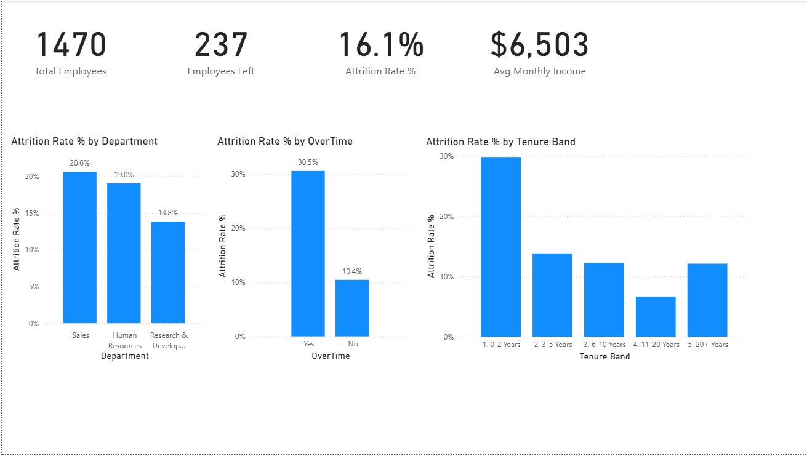
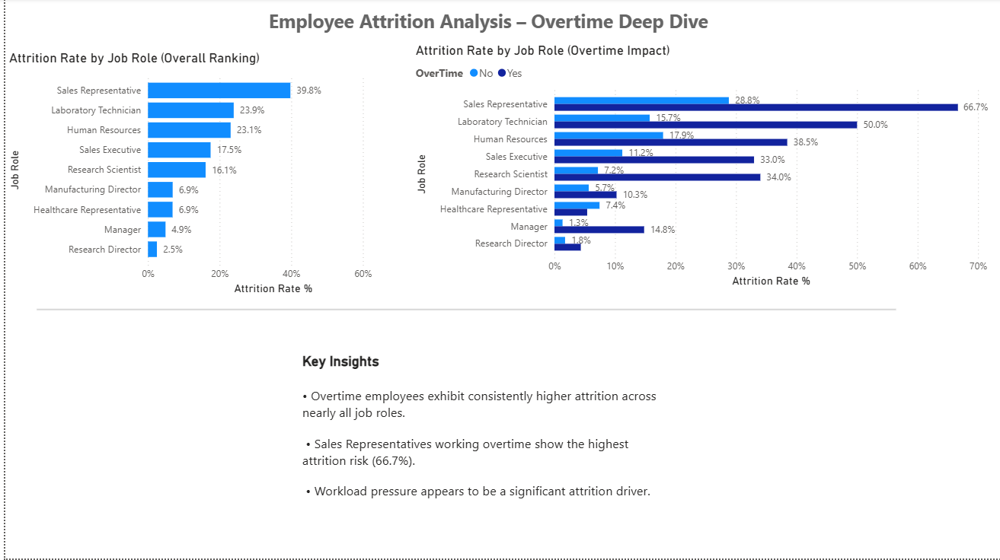
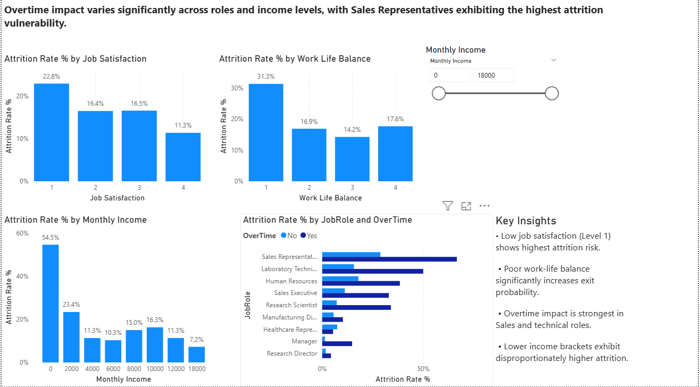
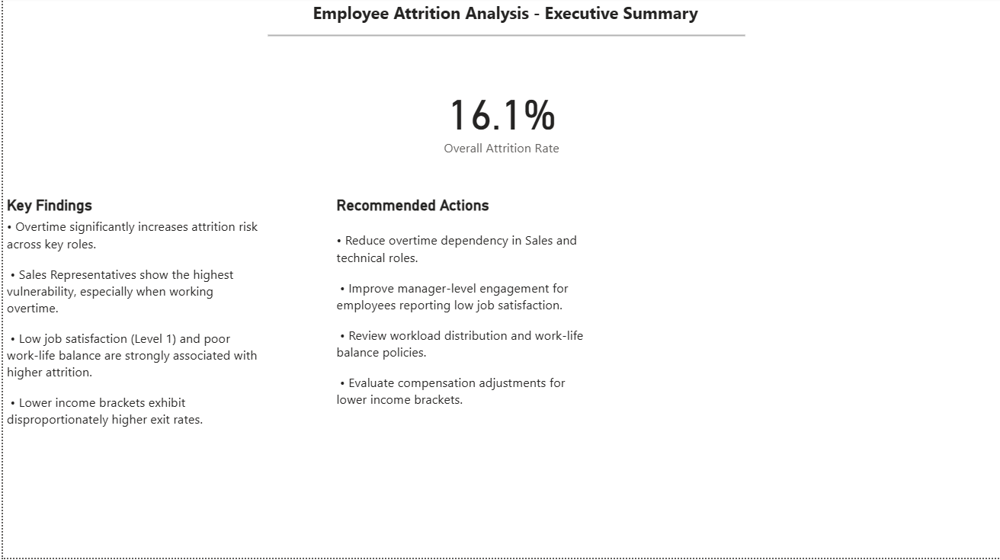

# HR Attrition Analysis Dashboard (Power BI)

## Project Overview
This Power BI project analyzes employee attrition patterns using HR data.  
The goal is to identify the main factors influencing employee turnover and provide insights that can help HR teams improve retention.

---

## Key Metrics
• Total Employees: 1470  
• Employees Left: 237  
• Attrition Rate: 16.1%  
• Average Monthly Income: $6,503  

---

## Key Business Questions
- Which departments experience the highest attrition?
- Does overtime significantly increase employee turnover?
- How do job satisfaction and work-life balance affect attrition?
- Are lower income employees more likely to leave?

---

## Dashboard Pages

### Executive Summary

Provides a high-level overview of attrition metrics and department-level attrition rates.

---

### Attrition Driver Analysis

Analyzes how key employee factors influence attrition including:

- Job satisfaction
- Work-life balance
- Monthly income
- Job role
- Overtime

---

### Income & Overtime Impact

Highlights the relationship between employee income levels and attrition risk.

---

### Overtime Deep Dive

Shows how overtime impacts attrition across different job roles.

Sales Representatives and Laboratory Technicians exhibit the highest attrition when working overtime.

---

## Key Insights

• Overtime significantly increases attrition risk across multiple roles.  
• Employees with **low job satisfaction (Level 1)** show the highest turnover probability.  
• Poor **work-life balance** strongly correlates with attrition.  
• Lower income employees show disproportionately higher exit rates.  
• Sales Representatives are the most vulnerable group to attrition.

---

## Tools Used
• Power BI  
• DAX  
• Data Modeling  
• Data Visualization  

---

## Files Included
• Power BI Report (.pbix)  
• Dashboard screenshots
